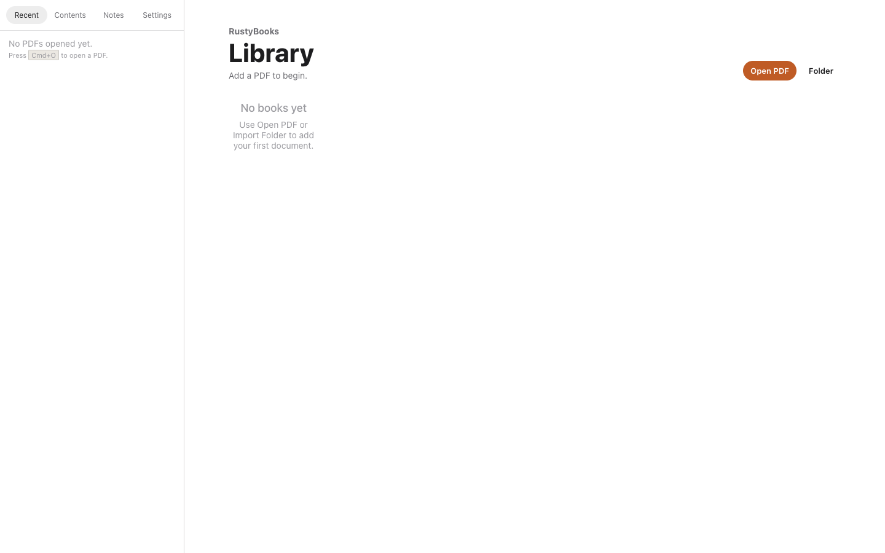

# RustyBooks

**An AI-native PDF reader for people who read deeply.**

RustyBooks is a local-first desktop reader built with Tauri, React, and PDF.js. It keeps track of the page, section, selected text, nearby context, notes, and citations so AI answers are grounded in the document you are actually reading.

<p>
  
  
</p>

## Why RustyBooks

- **Reading-state aware AI**: Explain a selection, summarize a page or range, and ask about the current section.
- **Grounded citations**: AI answers can reference pages like `[p.12]`, and citations jump back into the PDF.
- **Local-first library**: Recent documents, last page, zoom, notes, TOC, and provider settings are stored locally.
- **Bring your own model**: Works with OpenAI-compatible endpoints such as OpenAI, LM Studio, and Ollama.
- **Built for long PDFs**: Native TOC extraction, virtualized pages, background text extraction, and keyboard-first navigation.

## Current Status

RustyBooks is an MVP. The core reader, library, TOC, notes, citation parsing, provider settings, and AI workflows are implemented. Planned work includes continuous scroll polish, PDF text search, streaming responses, figure/region selection, and Markdown export improvements.

## Quick Start

```bash
npm install
npm run tauri dev
```

Build a release bundle:

```bash
npm run tauri build
```

Run checks:

```bash
npm test
npm run build
```

## Configure AI

Open **Settings** in the app and add any OpenAI-compatible provider:

| Field | Example |
| --- | --- |
| Base URL | `https://api.openai.com/v1` |
| API key | Your provider key |
| Model | `gpt-4o-mini` |

Local providers such as LM Studio and Ollama work when they expose an OpenAI-compatible API.

## Keyboard Shortcuts

| Key | Action |
| --- | --- |
| `Left` / `PageUp` | Previous page |
| `Right` / `PageDown` | Next page |
| `+` / `=` | Zoom in |
| `-` | Zoom out |
| `0` | Reset zoom |
| `E` | Explain selection |
| `Esc` | Clear selection |

## Tech Stack

| Layer | Technology |
| --- | --- |
| Desktop shell | Tauri v2 |
| Frontend | React 18, TypeScript, Vite |
| PDF rendering | PDF.js v4 |
| State | Zustand |
| Database | SQLite via Rust backend |
| AI API | OpenAI-compatible HTTP |

See [ai_native_pdf_reader_design_v0.5_agent_ready.md](ai_native_pdf_reader_design_v0.5_agent_ready.md) for the full design notes.
